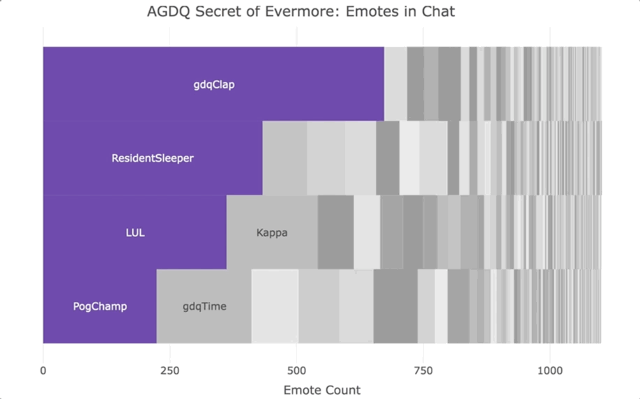

# Visualizing Emotes in Twitch Chat with a Packed Barchart

*this is an example of using a packed barchart to visualize emote usage in a [twitch.tv](https://www.twitch.tv) chat*

*TODO: blog write up with more about process*

****

Every January there's an awesome charity event on [twitch.tv](https://www.twitch.tv/gamesdonequick) called [Awesome Games Done Quick](https://gamesdonequick.com/) (AGDQ).  The charity has raised millions and millions of dollars for the [Prevent Cancer Foundation](https://preventcancer.org/).

 

I recorded the chat during one of the speedrunning segments of the event and decided to visualize the twitch emote usage.  The emote usage roughly follows an exponential distribution, so the packed barchart lends itself well to visualize the data.  Below is the resulting viz of emotes during the [Secret of Evermore](https://en.wikipedia.org/wiki/Secret_of_Evermore) speedrun by [MetaSigma](https://www.twitch.tv/metasigma).

Unsurpsing to anyone who's participated in a Games Done Quick chat, the number one used emote was [gdqClap](https://twitchemotes.com/emotes/104869) emote which viewers use to applaud runners for completing technical tricks.

